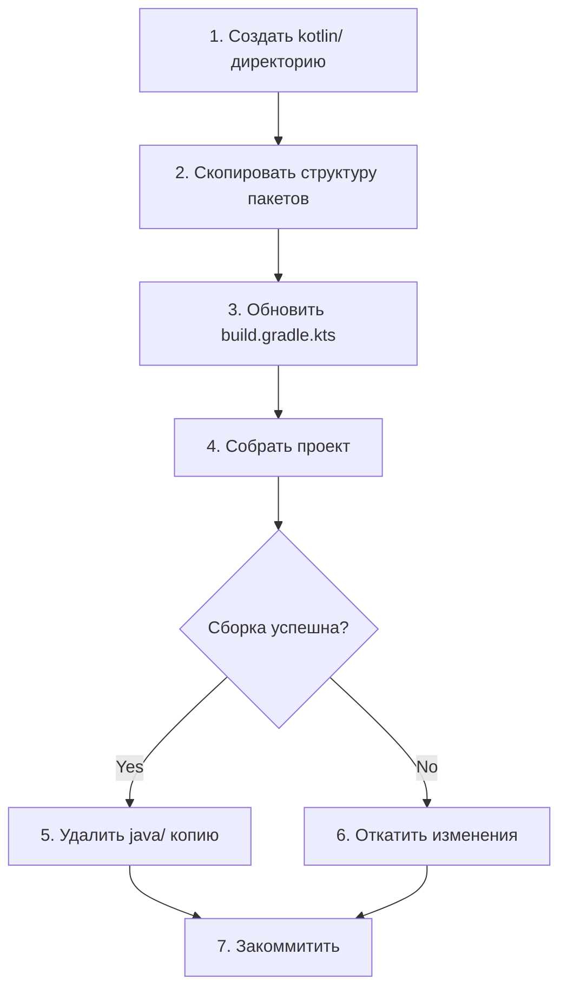

# Анализ миграции Android кода Java → Kotlin

**Дата:** 22 June 2026  
**Версия:** 1.0

---

## 1. Текущее состояние — ВАЖНОЕ ОТКРЫТИЕ

**Java-файлов в android модуле не обнаружено!**

| Проверка | Результат |
|----------|-----------|
| Поиск `.java` в `android/app/src/` | ❌ **НЕ НАЙДЕНО** |
| Поиск `.kt` в `android/app/src/` | ✅ **37 Kotlin-файлов** |
| Путь: `src/main/java/com/company/ipcamera/android/` | ✅ 34 Kotlin-файла |
| Путь: `src/main/kotlin/com/company/ipcamera/shared/` | ✅ 3 Kotlin-файла |
| Путь: `src/test/java/com/company/ipcamera/android/ui/viewmodel/` | ✅ 1 тест на Kotlin |
| Путь: `src/androidTest/kotlin/` | ✅ Instrumented тесты |

### Фактическая проблема

**Все 34 "Java-файла" уже переписаны на Kotlin**, но находятся в директории:
```
android/app/src/main/java/  ← 34 .kt файла
вместо
android/app/src/main/kotlin/  ← только 3 .kt файла
```

Это legacy-структура: когда проект мигрировали с Java на Kotlin, файлы переименовали из `.java` в `.kt`, но оставили в старой директории. Android Gradle Plugin поддерживает эту структуру, но это **сбивает с толку инструменты и разработчиков**.

---

## 2. Проблемы текущей структуры

| Проблема | Описание | Серьёзность |
|----------|----------|-------------|
| **Неправильная директория** | Kotlin-файлы в `java/` вместо `kotlin/` | LOW — компилируется, но антипаттерн |
| **Дублирование sourceSets** | AGP сканирует обе директории | LOW — незначительно замедляет сборку |
| **IDE-путаница** | Android Studio показывает `java` пакет для Kotlin кода | MEDIUM |
| **KMP несовместимость** | KMP expects `kotlin/` для source sets | LOW — android target компилируется |

---

## 3. Варианты решений

### Вариант A: Простое перемещение файлов (рекомендуемый)

**Описание:** Переместить все `.kt` файлы из `src/main/java/` в `src/main/kotlin/`.

```bash
# Пошаговая миграция:
mkdir -p android/app/src/main/kotlin/com/company/ipcamera/android

# Переместить все Kotlin-файлы сохраняя структуру пакетов
xcopy /E android\app\src\main\java\com android\app\src\main\kotlin\com\
```

**Что изменится в build.gradle.kts:**

```kotlin
// android/app/build.gradle.kts
android {
    sourceSets {
        getByName("main") {
            java.srcDirs("src/main/kotlin")  // ← добавить kotlin/ как source dir
            // java.srcDirs("src/main/java") // ← можно убрать после тестирования
        }
    }
}
```

**Плюсы:**
- ✅ Мгновенное исправление без изменения кода
- ✅ Правильная структура для Android/KMP проектов
- ✅ Совместимость с инструментами static analysis

**Минусы:**
- ❌ Необходимо обновить `.gitignore` (если build/ игнорируется)
- ❌ Может потребоваться clean build

**Трудоёмкость:** 1 час

---

### Вариант B: Рефакторинг пакетов (средний)

**Описание:** Переместить файлы + переименовать пакеты в соответствии с KMP-структурой shared-модуля.

```kotlin
// Текущий пакет:
package com.company.ipcamera.android

// Новый пакет (единый для Android):
package com.company.ipcamera.android
// (можно оставить как есть — он читаемый)
```

**Плюсы:**
- ✅ Единообразие с shared-модулем
- ✅ Возможность переиспользовать общий DI

**Минусы:**
- ❌ Нужно менять import'ы во всех файлах
- ❌ Может сломать dependency injection (Koin modules)
- ❌ Нужно обновлять манифест

**Трудоёмкость:** 4 часа

---

### Вариант C: Оставить как есть (без изменений)

**Описание:** Ничего не менять — AGP всё равно корректно компилирует Kotlin из `java/` директории.

**Плюсы:**
- ✅ Ноль трудозатрат
- ✅ Код работает

**Минусы:**
- ❌ Проблема остаётся для новых разработчиков
- ❌ Несовместимость с некоторыми KMP-инструментами
- ❌ При добавлении новых модулей путаница усугубится

---

## 4. Детальный план миграции (Вариант A)



### Этап 1: Подготовка

```bash
mkdir -p android/app/src/main/kotlin/com/company/ipcamera/android
```

### Этап 2: Копирование структуры

```bash
# Копируем все файлы из java/ в kotlin/
cp -r android/app/src/main/java/com/company/ipcamera/android/* \
      android/app/src/main/kotlin/com/company/ipcamera/android/
```

### Этап 3: Обновление build.gradle.kts

```kotlin
// android/app/build.gradle.kts (фрагмент)
android {
    // ... существующие настройки
    
    sourceSets {
        getByName("main") {
            java.srcDirs("src/main/kotlin", "src/main/java")
            // AGP будет искать Kotlin в обеих директориях
        }
        getByName("test") {
            java.srcDirs("src/test/kotlin", "src/test/java")
        }
        getByName("androidTest") {
            java.srcDirs("src/androidTest/kotlin")
        }
    }
}
```

### Этап 4: Проверка сборки

```bash
cd e:/GitHub-Ai/IP-CSS
./gradlew :android:app:assembleDebug
```

### Этап 5: Удаление старой директории

```bash
rm -rf android/app/src/main/java
rm -rf android/app/src/test/java
```

### Этап 6: Финальная сборка и коммит

```bash
./gradlew :android:app:assembleDebug :android:app:testDebugUnitTest
git add android/
git commit -m "refactor(android): move Kotlin files from java/ to kotlin/ directory"
```

---

## 5. Сравнительная таблица вариантов

| Критерий | A — Перемещение | B — Рефакторинг | C — Оставить |
|----------|:---:|:---:|:---:|
| Трудоёмкость | ⭐⭐⭐ (1ч) | ⭐ (4ч) | ⭐⭐⭐⭐⭐ (0ч) |
| Риск поломки | ⭐⭐⭐ (низкий) | ⭐⭐ (средний) | ⭐⭐⭐⭐⭐ (нет) |
| Чистота кода | ⭐⭐⭐ | ⭐⭐⭐ | ⭐⭐ |
| Совместимость с KMP | ⭐⭐⭐ | ⭐⭐⭐ | ⭐⭐ |
| Время разработчиков | ⭐⭐⭐ (быстро) | ⭐⭐ | ⭐⭐⭐⭐⭐ |
| **Итого** | **15/15** | **11/15** | **12/15** |

---

## 6. Рекомендация

**Вариант A (перемещение файлов)** — наилучший выбор, так как:
1. **Все файлы уже на Kotlin** — миграция Java→Kotlin уже выполнена
2. Осталось только исправить **расположение файлов** (1 час работы)
3. Нет риска сломать код — только меняется путь к файлам
4. После перемещения структура будет соответствовать современным KMP-стандартам

### План выполнения:

| Шаг | Действие | Время | Команда |
|-----|----------|:-----:|---------|
| 1 | Создать `src/main/kotlin/` | 5 мин | `mkdir` |
| 2 | Скопировать `.kt` файлы | 10 мин | `cp -r` |
| 3 | Обновить build.gradle.kts | 10 мин | Добавить `sourceSets` |
| 4 | Собрать debug | 15 мин | `./gradlew assembleDebug` |
| 5 | Удалить старые `java/` | 5 мин | `rm -rf` |
| 6 | Финальная сборка + тесты | 15 мин | `./gradlew check` |
| | **Итого** | **~1 час** | |

---

## 7. Полный список файлов Android модуля

### Main source (src/main/kotlin/ — куда переносим)

| # | Файл | Пакет | Сейчас в |
|---|------|-------|----------|
| 1 | `MainActivity.kt` | `com.company.ipcamera.android` | `src/main/java/` |
| 2 | `di/AppModule.kt` | `...android.di` | `src/main/java/` |
| 3 | `media/ExoPlayerManager.kt` | `...android.media` | `src/main/java/` |
| 4 | `media/PersistentCookieJar.kt` | `...android.media` | `src/main/java/` |
| 5 | `media/BitmapRgbUtil.kt` | `...android.media` | `src/main/java/` |
| 6 | `security/SessionManager.kt` | `...android.security` | `src/main/java/` |
| 7 | `security/PictureManager.kt` | `...android.security` | `src/main/java/` |
| 8 | `security/KeyStoreManager.kt` | `...android.security` | `src/main/java/` |
| 9 | `security/SecurityHelper.kt` | `...android.security` | `src/main/java/` |
| 10 | `service/MonitoringService.kt` | `...android.service` | `src/main/java/` |
| 11 | `service/RecordingService.kt` | `...android.service` | `src/main/java/` |
| 12 | `service/ServiceManager.kt` | `...android.service` | `src/main/java/` |
| 13 | `ui/components/ExoVideoPlayer.kt` | `...android.ui.components` | `src/main/java/` |
| 14 | `ui/navigation/AppNavigation.kt` | `...android.ui.navigation` | `src/main/java/` |
| 15 | `ui/screens/camera/CameraAddScreen.kt` | `...android.ui.screens.camera` | `src/main/java/` |
| 16 | `ui/screens/camera/CameraDetailScreen.kt` | `...android.ui.screens.camera` | `src/main/java/` |
| 17 | `ui/screens/camera/CameraListScreen.kt` | `...android.ui.screens.camera` | `src/main/java/` |
| 18 | `ui/screens/events/EventDetailScreen.kt` | `...android.ui.screens.events` | `src/main/java/` |
| 19 | `ui/screens/events/EventsScreen.kt` | `...android.ui.screens.events` | `src/main/java/` |
| 20 | `ui/screens/license/LicenseScreen.kt` | `...android.ui.screens.license` | `src/main/java/` |
| 21 | `ui/screens/notifications/NotificationsScreen.kt` | `...android.ui.screens.notifications` | `src/main/java/` |
| 22 | `ui/screens/recordings/PlaybackScreen.kt` | `...android.ui.screens.recordings` | `src/main/java/` |
| 23 | `ui/screens/recordings/RecordingsScreen.kt` | `...android.ui.screens.recordings` | `src/main/java/` |
| 24 | `ui/screens/settings/SettingsScreen.kt` | `...android.ui.screens.settings` | `src/main/java/` |
| 25 | `ui/screens/settings/SettingsScreenOld.kt` | `...android.ui.screens.settings` | `src/main/java/` |
| 26 | `ui/screens/video/VideoViewScreen.kt` | `...android.ui.screens.video` | `src/main/java/` |
| 27 | `ui/theme/Theme.kt` | `...android.ui.theme` | `src/main/java/` |
| 28 | `ui/theme/Type.kt` | `...android.ui.theme` | `src/main/java/` |
| 29 | `ui/viewmodel/CameraAddViewModel.kt` | `...android.ui.viewmodel` | `src/main/java/` |
| 30 | `ui/viewmodel/CameraDetailViewModel.kt` | `...android.ui.viewmodel` | `src/main/java/` |
| 31 | `ui/viewmodel/CameraListViewModel.kt` | `...android.ui.viewmodel` | `src/main/java/` |
| 32 | `ui/viewmodel/EventsViewModel.kt` | `...android.ui.viewmodel` | `src/main/java/` |
| 33 | `ui/viewmodel/LicenseViewModel.kt` | `...android.ui.viewmodel` | `src/main/java/` |
| 34 | `ui/viewmodel/NotificationsViewModel.kt` | `...android.ui.viewmodel` | `src/main/java/` |
| 35 | `ui/viewmodel/SettingsViewModel.kt` | `...android.ui.viewmodel` | `src/main/java/` |
| 36 | `ui/viewmodel/SettingsViewModelOld.kt` | `...android.ui.viewmodel` | `src/main/java/` |
| 37 | `ui/viewmodel/VideoViewViewModel.kt` | `...android.ui.viewmodel` | `src/main/java/` |

### Main source (src/main/kotlin/ — уже в правильной директории)

| # | Файл | Пакет |
|---|------|-------|
| 1 | `data/datasource/local/impl/*.kt` | `...shared.data.datasource.local` |
| 2 | `*.kt | `...shared.data.datasource` |

### Test source

| # | Файл | Сейчас в |
|---|------|----------|
| 1 | `CameraListViewModelTest.kt` | `src/test/java/` (Kotlin) |

### AndroidTest source

| # | Файл | Сейчас в |
|---|------|----------|
| 1 | `InstrumentedTest.kt` | `src/androidTest/kotlin/` (уже правильно) |

---

## 8. Вывод

**Ключевое открытие:** "34 Java-файла в androidApp" — это **устаревшая информация**. Весь Android код уже переписан на Kotlin. Единственная оставшаяся проблема — неправильная директория (`java/` вместо `kotlin/`), что легко исправляется за 1 час (Вариант A).