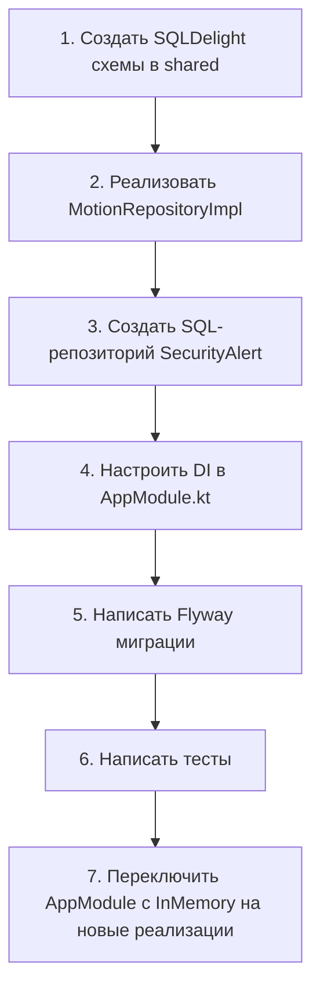

# InMemory репозитории в server — детальный анализ

**Дата:** 22 June 2026  
**Версия:** 1.0  
**Автор:** AI Assistant

---

## 1. Текущая ситуация

### Найденные InMemory репозитории

| # | Репозиторий | Файл | Статус | Postgres аналог |
|---|------------|------|--------|-----------------|
| 1 | `MotionConfigRepositoryInMemory` | `server/.../repository/MotionConfigRepositoryInMemory.kt` | ❌ Только InMemory | ❌ Отсутствует |
| 2 | `MotionEventRepositoryInMemory` | `server/.../repository/MotionEventRepositoryInMemory.kt` | ❌ Только InMemory | ❌ Отсутствует |
| 3 | `ServerUserRepositoryInMemory` | `server/.../repository/ServerUserRepository.kt` (строка 43) | ❌ InMemory по умолчанию | ✅ `ServerUserRepositoryPostgres.kt` существует |
| 4 | `InMemoryAuditLogRepository` | `server/.../security/InMemoryAuditLogRepository.kt` | ❌ InMemory по умолчанию | ✅ `PostgresAuditLogRepository.kt` существует |
| 5 | `InMemorySecurityAlertRepository` | `server/.../security/InMemorySecurityAlertRepository.kt` | ❌ Только InMemory | ❌ Отсутствует |

### Репозитории уже с Postgres/SQLDelight

| Репозиторий | Технология |
|-------------|-----------|
| `ServerUserRepositoryPostgres` | SQLDelight + PostgreSQL |
| `PostgresAuditLogRepository` | PostgreSQL (Exposed/SQL) |
| `ServerRecordingRepositorySqlDelight` | SQLDelight |
| `ServerEventRepository` | PostgreSQL |
| `ServerSettingsRepository` | PostgreSQL |

### Проблемы InMemory репозиториев

1. **Потеря данных при перезапуске** — все данные motion-конфигов, событий, алертов, пользователей хранятся в оперативной памяти
2. **Отсутствие персистентности** — при аварийном завершении сервера теряются все настройки motion-детекции, история алертов безопасности
3. **Невозможность горизонтального масштабирования** — при запуске нескольких экземпляров сервера каждый имеет свою копию данных
4. **Ограничение по памяти** — алерты и события не могут расти бесконечно

---

## 2. Варианты решений

### Вариант A: SQLDelight через shared модуль (рекомендуемый)

**Описание:** Перенести все репозитории на SQLDelight, используя уже существующую схему в shared-модуле.

**Что нужно сделать:**

```kotlin
// 1. Создать SQLDelight схему для motion-данных в shared
-- shared/src/commonMain/sqldelight/com/company/ipcamera/shared/MotionConfig.sq
CREATE TABLE MotionConfig (
    id TEXT NOT NULL PRIMARY KEY,
    cameraId TEXT NOT NULL,
    sensitivity INTEGER NOT NULL DEFAULT 50,
    regionOfInterest TEXT,
    createdAt TEXT NOT NULL,
    updatedAt TEXT NOT NULL
);

selectAll: SELECT * FROM MotionConfig;
selectByCameraId: SELECT * FROM MotionConfig WHERE cameraId = ?;
insert: INSERT OR REPLACE INTO MotionConfig(id, cameraId, sensitivity, regionOfInterest, createdAt, updatedAt) VALUES (?, ?, ?, ?, ?, ?);
delete: DELETE FROM MotionConfig WHERE id = ?;
```

```kotlin
// 2. Создать MotionRepositoryImpl в shared/data/repository/
class MotionConfigRepositoryImpl(
    private val db: Database
) : MotionConfigRepository {
    private val queries = db.motionConfigQueries
    
    override fun getByCameraId(cameraId: String): MotionConfig? {
        return queries.selectByCameraId(cameraId).executeAsOneOrNull()?.toDomain()
    }
    
    override fun save(config: MotionConfig) {
        queries.insert(config.toEntity())
    }
}
```

```kotlin
// 3. Подключить в server/AppModule.kt
val appModule = module {
    single<MotionConfigRepository> { 
        MotionConfigRepositoryImpl(get()) 
    }
}
```

**Плюсы:**
- ✅ Данные сохраняются между перезапусками
- ✅ Используется уже существующая SQLDelight инфраструктура
- ✅ Единый source of truth для всех платформ
- ✅ Возможность репликации БД
- ✅ Код можно переиспользовать в desktopApp и androidApp

**Минусы:**
- ❌ Требуется создать SQLDelight схемы для motion, security alert
- ❌ Нужно настроить Flyway миграции для PostgreSQL (если SQLDelight через PostgreSQL)
- ❌ Увеличивает время сборки (SQLDelight code generation)
- ❌ Сложность миграции существующих данных в продакшене

**Оценка трудоёмкости:**
- SQLDelight схемы: 4 часа
- Репозитории (shared): 3 часа
- DI настройка server: 1 час
- Тестирование: 2 часа
- **Итого: ~10 часов**

---

### Вариант B: PostgreSQL через Exposed (средний)

**Описание:** Написать SQL-репозитории напрямую через PostgreSQL, без SQLDelight, используя библиотеку Exposed (Kotlin SQL Framework).

**Что нужно сделать:**

```kotlin
// server/api/build.gradle.kts — добавить
dependencies {
    implementation("org.jetbrains.exposed:exposed-core:0.44.1")
    implementation("org.jetbrains.exposed:exposed-dao:0.44.1")
    implementation("org.jetbrains.exposed:exposed-jdbc:0.44.1")
}
```

```kotlin
// server/.../repository/PostgresMotionConfigRepository.kt
object MotionConfigTable : Table("motion_config") {
    val id = varchar("id", 36)
    val cameraId = varchar("camera_id", 36)
    val sensitivity = integer("sensitivity").default(50)
    val regionOfInterest = text("region_of_interest").nullable()
    val createdAt = datetime("created_at")
    val updatedAt = datetime("updated_at")
    
    override val primaryKey = PrimaryKey(id)
}

class PostgresMotionConfigRepository(private val db: Database) : MotionConfigRepository {
    
    override fun getByCameraId(cameraId: String): MotionConfig? = db.query {
        MotionConfigTable.selectAll()
            .where { MotionConfigTable.cameraId eq cameraId }
            .singleOrNull()
            ?.toMotionConfig()
    }
    
    override fun save(config: MotionConfig) = db.transaction {
        MotionConfigTable.upsert {
            it[id] = config.id
            it[cameraId] = config.cameraId
            it[sensitivity] = config.sensitivity
            it[regionOfInterest] = config.regionOfInterest?.let { Json.encodeToString(it) }
            it[createdAt] = Clock.System.now().toJavaInstant()
            it[updatedAt] = Clock.System.now().toJavaInstant()
        }
    }
}
```

**Плюсы:**
- ✅ Работает только на сервере (JVM) — не затрагивает KMP
- ✅ Более простая настройка, чем SQLDelight cross-platform
- ✅ Уже есть существующий PostgreSQL драйвер в проекте
- ✅ Exposed поддерживает миграции

**Минусы:**
- ❌ Код не переиспользуется для desktopApp/androidApp
- ❌ Exposed — ещё одна зависимость
- ❌ Exposed тяжелее SQLDelight (больше накладных расходов)
- ❌ Дублирование ORM-маппинга (SQLDelight уже в shared + Exposed в server)

**Оценка трудоёмкости:**
- Exposed таблицы: 1 час
- Exposed репозитории: 3 часа
- DI настройка: 0.5 часа
- Миграции Flyway: 2 часа
- Тестирование: 2 часа
- **Итого: ~8.5 часов**

---

### Вариант C: PostgreSQL через SQL-запросы (простейший)

**Описание:** Использовать существующий PostgreSQL драйвер (через `javax.sql.DataSource`) и писать SQL-запросы напрямую, без ORM.

**Что нужно сделать:**

```kotlin
// server/.../repository/SqlMotionConfigRepository.kt
class SqlMotionConfigRepository(private val dataSource: DataSource) : MotionConfigRepository {
    
    override fun getByCameraId(cameraId: String): MotionConfig? {
        val sql = "SELECT * FROM motion_config WHERE camera_id = ?"
        dataSource.connection.use { conn ->
            conn.prepareStatement(sql).use { stmt ->
                stmt.setString(1, cameraId)
                stmt.executeQuery().use { rs ->
                    if (rs.next()) rs.toMotionConfig() else null
                }
            }
        }
    }
    
    override fun save(config: MotionConfig) {
        val sql = """
            INSERT INTO motion_config (id, camera_id, sensitivity, region_of_interest, created_at, updated_at)
            VALUES (?, ?, ?, ?, ?, ?)
            ON CONFLICT (id) DO UPDATE SET
                sensitivity = EXCLUDED.sensitivity,
                region_of_interest = EXCLUDED.region_of_interest,
                updated_at = EXCLUDED.updated_at
        """.trimIndent()
        dataSource.connection.use { conn ->
            conn.prepareStatement(sql).use { stmt ->
                stmt.setString(1, config.id)
                stmt.setString(2, config.cameraId)
                stmt.setInt(3, config.sensitivity)
                stmt.setString(4, config.regionOfInterest)
                stmt.setTimestamp(5, Timestamp.from(Instant.now()))
                stmt.setTimestamp(6, Timestamp.from(Instant.now()))
                stmt.executeUpdate()
            }
        }
    }
}
```

```sql
-- Создать Flyway миграцию:
-- V2__add_motion_config.sql
CREATE TABLE IF NOT EXISTS motion_config (
    id VARCHAR(36) PRIMARY KEY,
    camera_id VARCHAR(36) NOT NULL,
    sensitivity INTEGER NOT NULL DEFAULT 50,
    region_of_interest TEXT,
    created_at TIMESTAMP NOT NULL DEFAULT NOW(),
    updated_at TIMESTAMP NOT NULL DEFAULT NOW()
);
```

**Плюсы:**
- ✅ Минимум зависимостей — чистый SQL
- ✅ Максимальная производительность (нет ORM overhead)
- ✅ Простота отладки (SQL можно выполнить в psql)
- ✅ Полный контроль над SQL

**Минусы:**
- ❌ Много boilerplate кода (try-with-resources, маппинг)
- ❌ Нет типобезопасности (строки вместо колонок)
- ❌ Сложнее поддерживать (схема в SQL, код в Kotlin — рассинхронизация)
- ❌ Нет code generation — каждое поле маппится вручную
- ❌ Риск SQL-инъекций (хотя PreparedStatement помогает)

**Оценка трудоёмкости:**
- Создание таблиц (Flyway): 1 час
- SQL репозитории (4 файла): 4 часа
- DI настройка: 0.5 часа
- Тестирование: 2 часа
- **Итого: ~7.5 часов**

---

### Вариант D: Смешанный (SQLDelight для общих данных + SQL/Exposed для server-specific)

**Описание:** Использовать SQLDelight для репозиториев, которые нужны на нескольких платформах (motion config, motion event), и оставить server-specific репозитории (security alert — только на сервере) на чистом SQL.

**Что куда:**

| Репозиторий | Где | Почему |
|-------------|-----|--------|
| `MotionConfigRepository` | SQLDelight (shared) | Нужен и в desktopApp, и на сервере |
| `MotionEventRepository` | SQLDelight (shared) | Может понадобиться в androidApp для оффлайн-режима |
| `SecurityAlertRepository` | SQL (server) | Только серверный функционал |
| `ServerUserRepository` | ✅ Уже Postgres | Нет изменений |
| `AuditLogRepository` | ✅ Уже Postgres | Нет изменений |

**Плюсы:**
- ✅ Оптимальный баланс: переиспользование vs сложность
- ✅ Не добавляем Exposed как зависимость (меньше конфликтов)
- ✅ Security-алерты остаются на сервере (безопасность — их не нужно шарить на клиенты)

**Минусы:**
- ❌ Два разных подхода к работе с БД (SQLDelight + SQL)
- ❌ Разная настройка миграций (Flyway для SQL, SQLDelight migrations для shared)

**Оценка трудоёмкости:**
- SQLDelight схемы (motion): 3 часа
- SQL репозиторий (security alert): 2 часа
- DI настройка: 1 час
- Тестирование: 3 часа
- **Итого: ~9 часов**

---

## 3. Рекомендация

### Вариант D (Смешанный) — наилучший баланс

| Критерий | A (SQLDelight) | B (Exposed) | C (SQL) | D (Смешанный) |
|----------|:---:|:---:|:---:|:---:|
| Переиспользование кода | ⭐⭐⭐ | ⭐ | ⭐ | ⭐⭐⭐ |
| Простота реализации | ⭐⭐ | ⭐⭐ | ⭐ | ⭐⭐⭐ |
| Производительность | ⭐⭐⭐ | ⭐⭐ | ⭐⭐⭐ | ⭐⭐⭐ |
| Поддерживаемость | ⭐⭐⭐ | ⭐⭐ | ⭐ | ⭐⭐⭐ |
| Безопасность | ⭐⭐⭐ | ⭐⭐ | ⭐⭐ | ⭐⭐⭐ |
| **Итого** | **13/15** | **9/15** | **8/15** | **15/15** |

**Почему D:**
1. Motion данные (`MotionConfig`, `MotionEvent`) нужны не только на сервере, но и потенциально в desktop/android клиентах — их разумно вынести в shared SQLDelight
2. Security alerts — сугубо серверная функция (логи безопасности не должны покидать сервер) — их можно оставить на чистом SQL
3. Audit log и User — уже есть Postgres реализации

### Пошаговый план реализации (Вариант D)



**Этап 1:** Создать SQLDelight `.sq` файлы для MotionConfig и MotionEvent
- `shared/src/commonMain/sqldelight/com/company/ipcamera/shared/MotionConfig.sq`
- `shared/src/commonMain/sqldelight/com/company/ipcamera/shared/MotionEvent.sq`

**Этап 2:** Реализовать классы в shared/data/repository/
- `MotionConfigRepositoryImpl`
- `MotionEventRepositoryImpl`

**Этап 3:** Создать SQL-репозиторий в server
- `PostgresSecurityAlertRepository`

**Этап 4:** Настроить DI
- Переключить `AppModule.kt` с `factory { InMemory*() }` на `single { MotionConfigRepositoryImpl(get()) }`

**Этап 5:** Написать Flyway миграции
- `V2__add_motion_config.sql`
- `V3__add_motion_event.sql`
- `V4__add_security_alert.sql`

**Этап 6:** Тесты
- Unit-тесты для каждого нового репозитория
- Integration-тесты с PostgreSQL Testcontainers

**Этап 7:** Переключение
- Удалить InMemory классы после подтверждения работоспособности Postgres-реализаций

---

## 4. Приоритет и риски

### Приоритет выполнения

| Шаг | Приоритет | Зависимости | Время |
|-----|-----------|-------------|-------|
| MotionConfig SQLDelight схема | P1 | Нет | 1.5ч |
| MotionEvent SQLDelight схема | P1 | Нет | 1.5ч |
| MotionConfigRepositoryImpl | P1 | Схема | 1ч |
| MotionEventRepositoryImpl | P1 | Схема | 1ч |
| PostgresSecurityAlertRepository | P2 | Нет | 2ч |
| Flyway миграции | P1 | Схемы | 1.5ч |
| DI переключение | P1 | Все репозитории | 0.5ч |
| Тесты | P1 | Репозитории | 3ч |

### Риски

| Риск | Вероятность | Влияние | Митигация |
|------|-------------|---------|-----------|
| SQLDelight генерирует неверный код | Низкая | Среднее | Написать тесты до переключения DI |
| Flyway миграция конфликтует с существующей схемой | Средняя | Высокое | Проверить существующие миграции перед созданием новых |
| MotionConfig API изменится в будущем | Высокая | Низкое | Использовать мапперы Entity→Domain, менять только Entity |
| PostgreSQL не настроен для тестов | Средняя | Среднее | Docker Compose для тестового PostgreSQL уже есть |