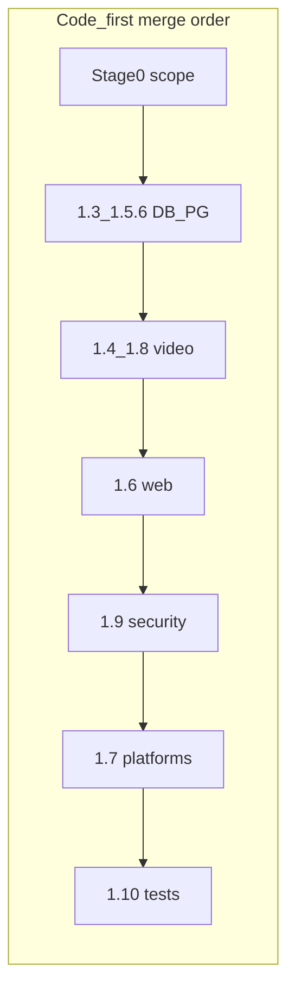

# План: разделы 3–4 PHASE1_MVP_TO_100 (детализация и приоритеты)

**Назначение:** подробная раскладка разделов 3–4 документа [PHASE1_MVP_TO_100_PLAN.md](PHASE1_MVP_TO_100_PLAN.md) для работы в репозитории (пошаговые действия, критерии, артефакты, приоритеты при нехватке ресурса).

**Источник:** [PHASE1_MVP_TO_100_PLAN.md](PHASE1_MVP_TO_100_PLAN.md) (этапы 3.1–3.7 и раздел 4). Статусы задач по ID: [PROJECT_STATUS_PHASES.md](../status/PROJECT_STATUS_PHASES.md). Блокеры: [CRITICAL_BLOCKERS_REMEDIATION_PLAN.md](CRITICAL_BLOCKERS_REMEDIATION_PLAN.md). Актуальные чеклисты: [TODO.md](../../archive/docs-duplicates-2026-08-08/TODO.md).

---

## Статус и прогресс (актуализация)

Ниже — **не замена** чекбоксов в [TODO.md](../../archive/docs-duplicates-2026-08-08/TODO.md), а **согласование** этого детального плана с фактом в репозитории на момент правки.

| Область | Состояние |
| --- | --- |
| **Высокий приоритет P2** (пагинация пользователей, Redis rate limit, **RTSP↔FFmpeg** на сервере, security headers Ktor/Next) | Закрыто в [TODO.md](../../archive/docs-duplicates-2026-08-08/TODO.md) (P2-1–P2-4). Это **опережает** чистый merge-order по инфраструктуре, но **не закрывает** этапы 1 (PG/миграции) и **нативный RTSP / приёмку ONVIF**. |
| **Этап 2 (видео): серверный контур** | P2-3 покрывает запись, HLS, HLS из записи, `FfmpegCli` и таймауты — база для шага 2.1 **на стороне сервера**. |
| **Этап 2 (видео): клиент и устойчивость** | По-прежнему открыты: **нативный RTSP**, long-run/reconnect/cleanup HLS, **`captureFrame`**; ONVIF (P1-2) — автоматизация: [MVP_PHASE1_AUTOMATED_ACCEPTANCE.md](../automation/MVP_PHASE1_AUTOMATED_ACCEPTANCE.md) (F1-1 и др. в [TODO.md](../../archive/docs-duplicates-2026-08-08/TODO.md)). |
| **Этап 3 (web)** | P1-1, P1-3, P1-4 — открыты. |
| **Этап 4 (Security MVP)** | P1-5 открыт; P2-4 (headers) **не равен** полному HTTPS enforcement + pinning + аудит по чеклисту [SECURITY_MVP_READINESS.md](../status/SECURITY_MVP_READINESS.md). |
| **Этап 5 (Android/Desktop)** | **Частично по Android:** live HLS через ExoPlayer с **OkHttp + синхронизация cookies с Ktor** (httpOnly JWT на сегментах HLS), **абсолютный URL** плейлиста в `StreamApiService`, переключатель **RTSP/HLS** на экране видео. **Не закрывает** W4-1 целиком: **фоновая запись (1.8.7)**, стабильность по runbook, Desktop (W4-2). |
| **Этап 6 (тесты / GO)** | Открыт по покрытию 1.10.2–1.10.4; **прогон на текущем шаге плана не обязателен** (2026-04-24) — позиция смещена к **Фазе 2 § 2.1**, подфокус **2.1.7** в [PROJECT_STATUS_PHASES.md](../status/PROJECT_STATUS_PHASES.md). См. также [PROJECT_STATUS.md](../status/PROJECT_STATUS.md). |
| **Этап 0** | W1-0 (фиксация scope и границ приёмки) и выравнивание **одной трактовки % / DoD** между `PROJECT_STATUS`, отчётами и индексом — **рекомендуется закрыть явной правкой документов**. |

**Вывод:** Фаза 1 **не считается завершённой**; P2 и точечный Android HLS — **прогресс по пути** к этапам 2 и 5, без замены критериев **discover → … → events** и **W4 / GO**.

---

## Согласование раздела 2 и раздел 4

В одном документе заданы два «порядка»:

- **Раздел 2 (code-first):** сначала данные/PostgreSQL и baseline, затем видео-транспорт, затем web, security, платформы, тесты — чтобы не переделывать UI поверх нестабильного backend.
- **Раздел 4 (приоритеты при дефиците ресурса):** сначала **RTSP + HLS**, затем **WebSocket в web**, **JWT httpOnly**, **HTTPS + pinning**, и только потом **PostgreSQL finalization**, **Android/Desktop**, **Integration/E2E**.

**Как использовать на практике:** раздел 4 — это порядок **максимизации ценности и снятия главных production-рисков** (видео и realtime). Раздел 2 — порядок **слияния и интеграции без лишних переделок**. При нехватке людей: **параллелить** (например, один поток — миграции/PostgreSQL по ночам/стенду, другой — RTSP/HLS) и не начинать массовый E2E до стабилизации транспорта.

Закрытые **P2-1–P2-4** соответствуют укреплению сервера и обвязки; они **совместимы** с разделом 4 (серверный видео-путь, заголовки), но **не отменяют** пункты 1–7 раздела 4 по оставшимся P1.

---

## 3. Детальный план по этапам (пошагово)

### 3.1 Этап 0: фиксация контуров MVP

| Шаг | Действие | Результат |
| --- | --- | --- |
| 0.1 | Список must-have сценариев: discover, live, record, replay, events, auth, web + Android + Desktop (iOS — in/out явно) | Зафиксированный scope |
| 0.2 | Согласовать чеклисты: [RELEASE_GO_NO_GO_CHECKLIST.md](RELEASE_GO_NO_GO_CHECKLIST.md), W4 в том же файле, [W4_MVP_PLATFORM_SMOKE_RUNBOOK.md](../reports/W4_MVP_PLATFORM_SMOKE_RUNBOOK.md), `scripts/w4-mvp-platform-and-gate.ps1` | Единая приёмка |
| 0.3 | Выровнять формулировки в [PROJECT_STATUS.md](../status/PROJECT_STATUS.md), [TODO.md](../../archive/docs-duplicates-2026-08-08/TODO.md) (в т.ч. **одна трактовка процента готовности** или отказ от разных % в заголовках) | Нет противоречий по «100% Фазы 1» |

**Критерий:** один scope, одна трактовка DoD (раздел 5 исходного документа PHASE1_MVP_TO_100_PLAN).

---

### 3.2 Этап 1: 1.3 + 1.5 — данные и серверный baseline

Привязка к ID: **1.3.5**, **1.3.6**, **1.5.6** ([PROJECT_STATUS_PHASES.md](../status/PROJECT_STATUS_PHASES.md)).

| Шаг | Действие | Результат |
| --- | --- | --- |
| 1.1 | Завершить **миграции SQLDelight**: версии, `MigrationManager`, тесты вперёд/назад | Предсказуемые обновления схемы |
| 1.2 | Документировать и прогнать **smoke после миграции** и **rollback rehearsal** на staging | Воспроизводимый откат |
| 1.3 | **PostgreSQL:** cutover на staging, проверка `DB_MODE`/guardrails, сценарий отката к SQLite/backup по вашему runbook | Готовность production path |
| 1.4 | **Repository V2** по шести основным сущностям — закрыто; дальше — миграции 1.3.6 и PG 1.5.6 | Стабильный слой данных |

**Критерий:** staging cutover + rollback rehearsal успешны; базовые smoke по БД/репозиториям стабильны.

---

### 3.3 Этап 2: 1.4 + 1.8 — видео и транспорт

Привязка: **1.4.5**, **1.4.6**, **1.8.1–1.8.4**, **1.8.2**, ONVIF Events (P1-2 / F1-2): автоматизируемо — [MVP_PHASE1_AUTOMATED_ACCEPTANCE.md](../automation/MVP_PHASE1_AUTOMATED_ACCEPTANCE.md).

| Шаг | Действие | Результат |
| --- | --- | --- |
| 2.1a | **Серверный контур RTSP↔FFmpeg↔HLS/запись** (таймауты, обработка ошибок на стороне сервисов) — в [TODO.md](../../archive/docs-duplicates-2026-08-08/TODO.md) закрыто как **P2-3** | База для production-path на сервере |
| 2.1b | **Нативный RTSP-клиент** и полная склейка с записью/HLS без «дыр» (см. F1-1, блокеры в [PROJECT_STATUS.md](../status/PROJECT_STATUS.md)) | Завершение шага 2.1 по клиенту/нативу |
| 2.2 | **HLS:** long-run, reconnect, cleanup процессов/файлов, live + записи ([CANONICAL_BREAKDOWN_1_8](../status/CANONICAL_BREAKDOWN_1_8_VIDEO_AND_RECORDING.md) если используется) | Нет деградации на длительных прогонах |
| 2.3 | **Screenshot / `captureFrame(...)`** — завершить контракт и стабильность | Закрытие 1.8.3 |
| 2.4 | **ONVIF Events:** тесты в репозитории; при наличии камеры — `onvif-events-api-verification.ps1`, при необходимости отчёт | Закрытие P1-2 / F1-2 |

**Критерий:** цепочка **discover → play → record → replay → events** устойчива; длительные прогоны без утечек/деградации.

---

### 3.4 Этап 3: 1.6 — Web closure

Привязка: **1.6.3–1.6.5**, P1-1, P1-3, P1-4; опционально [WEB_INTERFACE_PERF_MANUAL_CHECKLIST.md](../status/WEB_INTERFACE_PERF_MANUAL_CHECKLIST.md) (W3-4).

| Шаг | Действие | Результат |
| --- | --- | --- |
| 3.1 | **WebSocket (Next.js):** подписки на каналы (cameras, events, recordings, notifications), обновления в Redux/UI | P1-1 |
| 3.2 | **Reconnect:** backoff, восстановление сессии, при необходимости dedupe сообщений | Устойчивый realtime |
| 3.3 | **JWT:** httpOnly cookies + refresh lifecycle, согласованность с сервером | P1-4 |
| 3.4 | **Видеоплеер web:** тот же HLS/RTSP backend path, что и мобильные/десктоп; единая семантика ошибок | P1-3 / F1-3 |
| 3.5 | Минимум CI: `npm run build` + `npm test` (web); опционально полный Lighthouse по чеклисту | W3-4 |

**Критерий:** критические web P1 закрыты; perf — по договорённости scope.

---

### 3.5 Этап 4 (документа PHASE1): 1.9 — Security MVP closure

Привязка: **1.9.3–1.9.6** (HTTPS, pinning, секреты камер, аудит). Чеклист: [SECURITY_MVP_READINESS.md](../status/SECURITY_MVP_READINESS.md).

| Шаг | Действие | Результат |
| --- | --- | --- |
| 4.1 | **HTTPS enforcement** на Ktor и согласование с Next/proxy | Нет «случайного» HTTP в prod |
| 4.2 | **Certificate pinning** на Android/Desktop (модель для web — как в статусе: браузер не в claim) | P1-5 в части клиентов |
| 4.3 | Валидация **шифрования учёток камер** и миграции legacy plaintext на staging | 1.9.5 закрыт по факту |
| 4.4 | **Аудит / security logging** для критичных операций в production-профиле | 1.9.6 |

**Примечание:** **P2-4** (CSP, HSTS и др. заголовки) уже закрыт — это **усиливает** контур, но **не заменяет** 4.1–4.4 по чеклисту Security MVP.

**Критерий:** Security MVP checklist зелёный; нет открытых high по auth/session/transport.

---

### 3.6 Этап 5: 1.7 — Android / Desktop closure

Привязка: **1.7.2**, **1.7.3**, **1.7.5**, **1.8.6**, **1.8.7**. Приёмка: [W4_MVP_PLATFORM_SMOKE_RUNBOOK.md](../reports/W4_MVP_PLATFORM_SMOKE_RUNBOOK.md), gate [scripts/w4-mvp-platform-and-gate.ps1](../../scripts/w4-mvp-platform-and-gate.ps1).

| Шаг | Действие | Результат |
| --- | --- | --- |
| 5.1 | **Android:** стабильный live (RTSP/HLS), **фоновая запись**, разрешения, хранение секретов | W4-1 |
| 5.2 | **Desktop:** long-run видео + экраны событий | W4-2 |
| 5.3 | **ARM/x86** для обязательных сценариев | Паритет по матрице |

**Прогресс по 5.1 (не закрывает W4-1):** HLS в ExoPlayer через OkHttp с **теми же cookies**, что у Ktor `ApiClient` (сегменты и плейлист под JWT); разрешение **относительного/абсолютного** HLS URL в `StreamApiService`; UI **переключения RTSP/HLS**. Остаётся: **фоновая запись**, регрессии, прохождение runbook.

**Критерий:** MVP smoke без критических регрессий на целевых платформах.

---

### 3.7 Этап 6: 1.10 — тестирование и приёмка

Привязка: **1.10.2–1.10.4**, W4-3–W4-5.

| Шаг | Действие | Результат |
| --- | --- | --- |
| 6.1 | **Integration:** `./gradlew mvpAutomatedAcceptance` + CI **`mvp-automated-acceptance`** (`scripts/ci/mvp-automated-acceptance.sh`: web + `video-e2e-go-no-go.ps1` с **`mvp-ci`** в GitHub Actions + Phase1 summary); расширять REST/БД покрытие и field video path | Воспроизводимые проверки |
| 6.2 | **E2E smoke:** только утверждённые критические пользовательские сценарии | W4-4 |
| 6.3 | **Матрица приёмки + GO/NO-GO** по [RELEASE_GO_NO_GO_CHECKLIST.md](RELEASE_GO_NO_GO_CHECKLIST.md); prerequisite: зелёный автоматический gate из [MVP_PHASE1_AUTOMATED_ACCEPTANCE.md](../automation/MVP_PHASE1_AUTOMATED_ACCEPTANCE.md) | W4-5 |

**Критерий:** тестовый контур стабильно green; формальное решение GO.

---

## 4. Приоритеты «если ресурса мало» — трактовка и пошаговое применение

Исходный порядок из раздела 4 [PHASE1_MVP_TO_100_PLAN.md](PHASE1_MVP_TO_100_PLAN.md):

1. RTSP native + HLS runtime stability
2. Полный WebSocket contour в web
3. Безопасное хранение JWT в web
4. HTTPS enforcement + pinning + security closure
5. PostgreSQL finalization и migration rehearsal
6. Android/Desktop MVP stability
7. Integration/E2E completion

**Связь с фактом:** пункт **1** частично закрыт на **сервере** (P2-3); **нативный RTSP** и **устойчивость HLS во времени** остаются в зоне 1. Пункт **6** частично продвинут на **Android live HLS** (см. этап 5), без полной приёмки W4.

### Как этим пользоваться

- **Нельзя «выкинуть» из MVP:** пункты **1–3** по сути закрывают основной продукт (видео + realtime + безопасная сессия в web). Без **4** релиз в открытую сеть нежелателен — минимизировать хотя бы HTTPS + критичный аудит.
- **Можно сдвигать по календарю, но не игнорировать слой данных:** **5** в списке приоритетов ниже видео, но **миграции/rollback** должны быть готовы до объявления 100% — иначе production-развёртывание остаётся риском. Имеет смысл **параллелить** 5 с 1–2 на разных людях/стендах.
- **6** (платформы) — после стабильного API и HLS.
- **7** (Integration/E2E) — последним по приоритету ресурса, но **не последним по определению готовности**: без минимального green-контура раздел 5 DoD в PHASE1_MVP_TO_100_PLAN не выполняется; допустимо сузить E2E до 1–2 сценариев при жёстком лимите времени.

### Мини-матрица «что откладываем первым при жёстком дефиците»

| Сжатие | Сначала сохранить | Первым отложить/упростить |
| --- | --- | --- |
| Недостаток времени | 1→2→3→4 по разделу 4 | Perf web (W3-4), расширенный E2E |
| Недостаток стендов | PostgreSQL rehearsal на одном staging | Параллельные платформенные прогоны |
| Недостаток людей | Один поток: video+WS; второй: DB+security по очереди | Документация и «косметические» отчёты |

---

## Календарная привязка (из раздела 6 исходного документа)

- **Неделя 1:** этапы 0–1 + старт этапа 2 ([TODO.md](../../archive/docs-duplicates-2026-08-08/TODO.md): W1-0 … W1-3).
- **Неделя 2:** завершение этапа 2 (W2-1 … W2-3).
- **Неделя 3:** этапы 3–4 документа (web + security, W3-1 … W3-5).
- **Неделя 4:** этапы 5–6 (платформы + тесты + go/no-go, W4-1 … W4-5).

Оценка в исходнике: **3–4 недели** при **фиксированном** scope (после закрытия W1-0). До фиксации scope календарь **условный**.

---

## Чеклист этапов (для отметок в процессе)

- [ ] **Этап 0:** scope, iOS in/out, выровнять TODO / RELEASE / W4 runbook; **согласовать одну трактовку % / DoD** в статус-документах
- [ ] **Этап 1:** миграции 1.3.6 + repository V2 1.3.5 + PostgreSQL 1.5.6 (cutover, smoke, rollback rehearsal)
- [ ] **Этап 2 (полное закрытие):** нативный RTSP 1.4.5 + HLS/recording/screenshot 1.8 + ONVIF Events (P1-2), см. автоматизацию в [MVP_PHASE1_AUTOMATED_ACCEPTANCE.md](../automation/MVP_PHASE1_AUTOMATED_ACCEPTANCE.md)
  - [x] **Подэтап:** серверный RTSP↔FFmpeg/HLS/запись (**P2-3** в [TODO.md](../../archive/docs-duplicates-2026-08-08/TODO.md))
- [ ] **Этап 3:** WebSocket 1.6.3, JWT httpOnly 1.6.5, видеоплеер web 1.6.4; опционально perf checklist
- [ ] **Этап 4:** HTTPS 1.9.4, pinning 1.9.3, секреты камер 1.9.5, аудит 1.9.6
  - [x] **Подэтап:** security headers (CSP, HSTS, …) — **P2-4**; не равен полному этапу 4
- [ ] **Этап 5:** Android 1.7.2/1.8.7 + Desktop 1.7.3/1.8.6, ARM/x86; W4 runbook + gate script
  - [ ] **Подэтап Android:** live HLS с cookies Ktor + абсолютный HLS URL + переключатель RTSP/HLS (**не** равно W4-1)
- [ ] **Этап 6:** integration 1.10.2–1.10.3, E2E smoke 1.10.4, GO/NO-GO и отчёты
- [ ] **При нехватке ресурса:** следовать разделу 4 исходного плана (видео→WS→JWT→security→PG→клиенты→тесты), параллелить PG с видео, не откладывать rollback/migrations до конца
